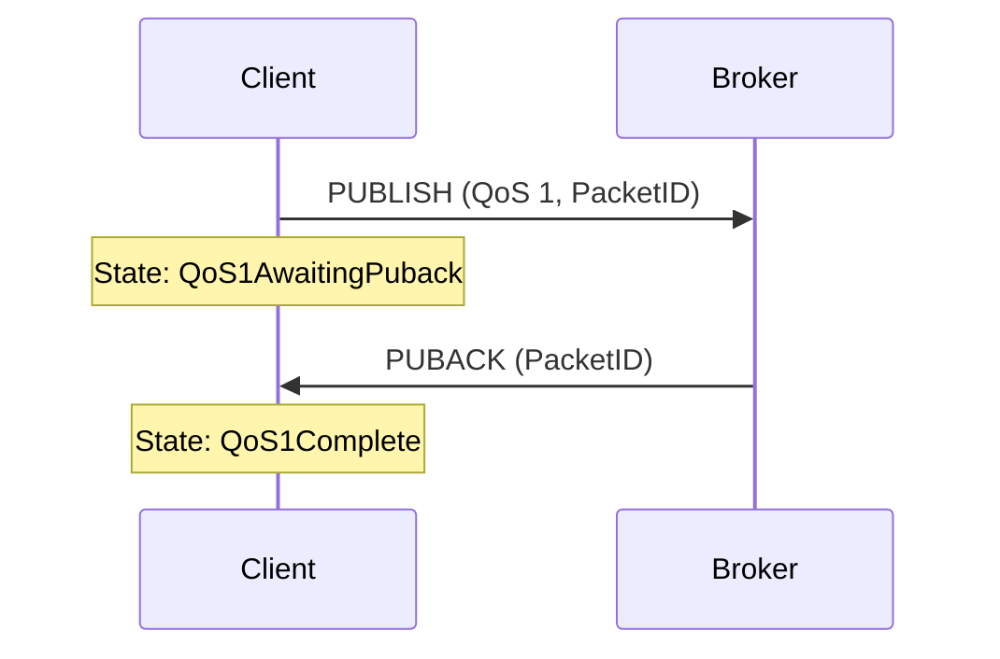
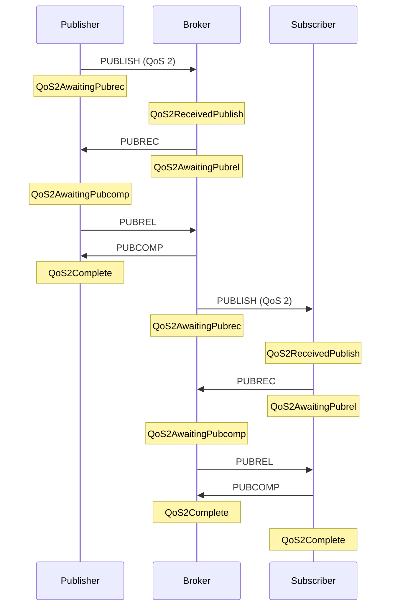

# Inflight Message Tracking

The MQTT v5.0 SDK tracks in-flight QoS 1 and QoS 2 messages on both client and server sides.
Messages are tracked from the moment they are sent until acknowledgment is complete,
with automatic retry logic and session persistence across reconnects.

## Client Side

### Inspecting In-Flight Messages

The `Client` exposes in-flight messages through two methods:

```go
// Get all in-flight QoS 1 messages
qos1 := client.InflightQoS1()

// Get all in-flight QoS 2 messages
qos2 := client.InflightQoS2()
```

### Print all in-flight messages

```go
for _, msg := range client.InflightQoS1() {
    fmt.Printf("QoS1 id=%d topic=%s retries=%d sent=%s\n",
        msg.PacketID, msg.Message.Topic, msg.RetryCount, msg.SentAt)
}

for _, msg := range client.InflightQoS2() {
    fmt.Printf("QoS2 id=%d topic=%s state=%d sender=%v sent=%s\n",
        msg.PacketID, msg.Message.Topic, msg.State, msg.IsSender, msg.SentAt)
}
```

### Monitor in-flight count

```go
ticker := time.NewTicker(5 * time.Second)
defer ticker.Stop()

for range ticker.C {
    qos1 := client.InflightQoS1()
    qos2 := client.InflightQoS2()
    fmt.Printf("In-flight: QoS1=%d QoS2=%d\n", len(qos1), len(qos2))
}
```

### Find messages pending retry

```go
for _, msg := range client.InflightQoS1() {
    if msg.ShouldRetry() {
        fmt.Printf("QoS1 id=%d needs retry (attempt %d)\n",
            msg.PacketID, msg.RetryCount)
    }
}

for _, msg := range client.InflightQoS2() {
    if msg.ShouldRetry() {
        fmt.Printf("QoS2 id=%d needs retry (attempt %d, state=%d)\n",
            msg.PacketID, msg.RetryCount, msg.State)
    }
}
```

### Flow Control Configuration

Set the client's Receive Maximum to limit inbound QoS 1/2 messages from the server:

```go
client, err := mqttv5.Dial(
    mqttv5.WithServers("tcp://localhost:1883"),
    mqttv5.WithReceiveMaximum(100),
)
```

The server's Receive Maximum (limits outbound QoS 1/2 from the client) is
automatically applied from the CONNACK packet.

### Reconnect Behavior

On reconnect with `CleanStart(false)`, the client automatically resends
in-flight messages from the session with the DUP flag set.

## Server Side

On the server side, in-flight messages are accessed through the `Session` interface
via `ServerClient.Session()`. Use `Server.GetClient()` to look up any connected client
by namespace and client ID.

### Inside OnMessage callback

```go
srv := mqttv5.NewServer(
    mqttv5.WithListener(listener),
    mqttv5.OnMessage(func(c *mqttv5.ServerClient, msg *mqttv5.Message) {
        session := c.Session()
        if session == nil {
            return
        }

        for id, m := range session.InflightQoS1() {
            fmt.Printf("Client %s: QoS1 id=%d topic=%s state=%d\n",
                c.ClientID(), id, m.Message.Topic, m.State)
        }

        for id, m := range session.InflightQoS2() {
            fmt.Printf("Client %s: QoS2 id=%d topic=%s state=%d sender=%v\n",
                c.ClientID(), id, m.Message.Topic, m.State, m.IsSender)
        }
    }),
)
```

### Inspect a specific client

```go
sc := srv.GetClient(mqttv5.DefaultNamespace, "device-001")
if sc == nil {
    return
}

session := sc.Session()
if session == nil {
    return
}

for id, msg := range session.InflightQoS1() {
    fmt.Printf("QoS1 id=%d topic=%s state=%d retries=%d\n",
        id, msg.Message.Topic, msg.State, msg.RetryCount)
}

for id, msg := range session.InflightQoS2() {
    fmt.Printf("QoS2 id=%d topic=%s state=%d sender=%v\n",
        id, msg.Message.Topic, msg.State, msg.IsSender)
}
```

### Iterate over all connected clients

Use `Server.Clients()` to list connected clients, optionally filtered by namespace.
Each entry contains both `Namespace` and `ClientID`:

```go
// All namespaces
for _, c := range srv.Clients() {
    sc := srv.GetClient(c.Namespace, c.ClientID)
    if sc == nil {
        continue
    }

    session := sc.Session()
    if session == nil {
        continue
    }

    qos1 := session.InflightQoS1()
    qos2 := session.InflightQoS2()
    fmt.Printf("Client %s/%s: QoS1=%d QoS2=%d in-flight\n",
        c.Namespace, c.ClientID, len(qos1), len(qos2))
}

// Specific namespace
for _, c := range srv.Clients("tenant-123") {
    sc := srv.GetClient(c.Namespace, c.ClientID)
    // ...
}
```

### Session interface methods

| Method | Return Type | Description |
|--------|-------------|-------------|
| `InflightQoS1()` | `map[uint16]*QoS1Message` | All in-flight QoS 1 messages |
| `GetInflightQoS1(packetID)` | `(*QoS1Message, bool)` | Single QoS 1 message by packet ID |
| `InflightQoS2()` | `map[uint16]*QoS2Message` | All in-flight QoS 2 messages |
| `GetInflightQoS2(packetID)` | `(*QoS2Message, bool)` | Single QoS 2 message by packet ID |
| `PendingMessages()` | `map[uint16]*Message` | Messages awaiting acknowledgment |

## Message Types

### QoS1Message

| Field | Type | Description |
|-------|------|-------------|
| `PacketID` | `uint16` | MQTT packet identifier |
| `Message` | `*Message` | The original message (Topic, Payload, etc.) |
| `State` | `QoS1State` | `QoS1AwaitingPuback` (0) or `QoS1Complete` (1) |
| `SentAt` | `time.Time` | When the message was last sent |
| `RetryCount` | `int` | Number of retry attempts |
| `RetryTimeout` | `time.Duration` | Configured retry interval |

### QoS2Message

| Field | Type | Description |
|-------|------|-------------|
| `PacketID` | `uint16` | MQTT packet identifier |
| `Message` | `*Message` | The original message (Topic, Payload, etc.) |
| `State` | `QoS2State` | Current state (see table below) |
| `SentAt` | `time.Time` | When the message was last sent |
| `RetryCount` | `int` | Number of retry attempts |
| `RetryTimeout` | `time.Duration` | Configured retry interval |
| `IsSender` | `bool` | `true` if this side initiated the publish |

### QoS 2 States

| State | Value | Side | Description |
|-------|-------|------|-------------|
| `QoS2AwaitingPubrec` | 0 | Sender | PUBLISH sent, waiting for PUBREC |
| `QoS2AwaitingPubcomp` | 1 | Sender | PUBREL sent, waiting for PUBCOMP |
| `QoS2ReceivedPublish` | 2 | Receiver | PUBLISH received, PUBREC not yet sent |
| `QoS2AwaitingPubrel` | 3 | Receiver | PUBREC sent, waiting for PUBREL |
| `QoS2Complete` | 4 | Both | Flow complete |

## Message Flow Diagrams

### QoS 1



### QoS 2

The broker sits between the publishing client and subscribing client.
Each side runs an independent QoS 2 handshake with the broker.


